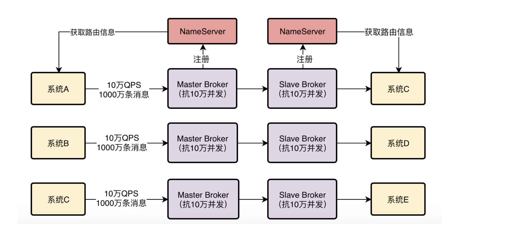

# RocketMQ架构原理图

2、NameServer集群化部署，保证高可用性

首先第一步，我们要让NameServer集群化部署，我建议可以部署在三台机器上，这样可以充分保证NameServer作为路由中心的可用性，哪怕是挂掉两台机器，只要有一个NameServer还在运行，就能保证MQ系统的稳定性。

每台NameServer实际上都会有完整的集群路由信息，包括所有的Broker节点信息，我们的数据信息，等等。所以只要任何一台NameServer存活下来，就可以保证MQ系统正常运行，不会出现故障。

3、基于Dledger的Broker主从架构部署

经过上次的分享我们已经知道，如果采用RocketMQ 4.5以前的那种普通的Master-Slave架构来部署，能在一定程度上保证数据不丢失，也能保证一定的可用性。

但是那种方式的缺陷是很明显的，最大的问题就是当Master Broker挂了之后，没办法让Slave Broker自动切换为新的Master Broker，需要手工做一些运维操作，修改配置以及重启机器才行，这个非常麻烦。

所以既然现在RocketMQ 4.5之后已经基于Dledger技术实现了可以自动让Slave切换为Master的功能，那么我们肯定是选择基于Dledger的主备自动切换的功能来进行生产架构的部署。

而且Dledger技术是要求至少得是一个Master带两个Slave，这样有三个Broke组成一个Group，也就是作为一个分组来运行。一旦Master宕机，他就可以从剩余的两个Slave中选举出来一个新的Master对外提供服务。

每个Broker（不论是Master和Slave）都会把自己注册到所有的NameServer上去。

4、Broker是如何跟NameServer进行通信的？

小猛说到这里停顿了一下，想了想然后继续说到，之前我们分享的时候就说过，这个Broker会每隔30秒发送心跳到所有的NameServer上去，然后每个NameServer都会每隔10s检查一次有没有哪个Broker超过120s没发送心跳的，如果有，就认为那个Broker已经宕机了，从路由信息里要摘除这个Broker。

首先，Broker跟NameServer之间的通信是基于什么协议来进行的？HTTP协议？RPC调用？还是TCP长连接？在RocketMQ的实现中，采用的是TCP长连接的方式。也就是说，Broker会跟每个NameServer都建立一个TCP长连接，然后定时通过TCP长连接发送心跳请求过去。

所以各个NameServer就是通过跟Broker建立好的长连接不断收到心跳包，然后定时检查Broker有没有120s都没发送心跳包，来判定集群里各个Broker到底挂掉了没有。

7、Topic作为一个数据集合是怎么在Broker集群里存储的？

分布式存储

我们可以在创建Topic的时候指定让他里面的数据分散存储在多台Broker机器上，比如一个Topic里有1000万条数据，此时有2台Broker，那么就可以让每台Broker上都放500万条数据。

8、生产者系统是如何将消息发送给Broker的？
首先我们之前说过，在发送消息之前，得先有一个Topic，然后在发送消息的时候你得指定你要发送到哪个Topic里面去。

接着既然你知道你要发送的Topic，那么就可以跟NameServer建立一个TCP长连接，然后定时从他那里拉取到最新的路由信息，包括集群里有哪些Broker，集群里有哪些Topic，每个Topic都存储在哪些Broker上。

然后生产者系统自然就可以通过路由信息找到自己要投递消息的Topic分布在哪几台Broker上，此时可以根据负载均衡算法，从里面选择一台Broke机器出来，比如round robine轮询算法，或者是hash算法，都可以。

总之，选择一台Broker之后，就可以跟那个Broker也建立一个TCP长连接，然后通过长连接向Broker发送消息即可.

这里唯一要注意的一点，就是生产者一定是投递消息到Master Broker的，然后Master Broker会同步数据给他的Slave Brokers，实现一份数据多份副本，保证Master故障的时候数据不丢失，而且可以自动把Slave切换为Master提供服务。

9、消费者是如何从Broker上拉取消息的？

消费者系统其实跟生产者系统原理是类似的，他们也会跟NameServer建立长连接，然后拉取路由信息，接着找到自己要获取消息的Topic在哪几台Broker上，就可以跟Broker建立长连接，从里面拉取消息了。

