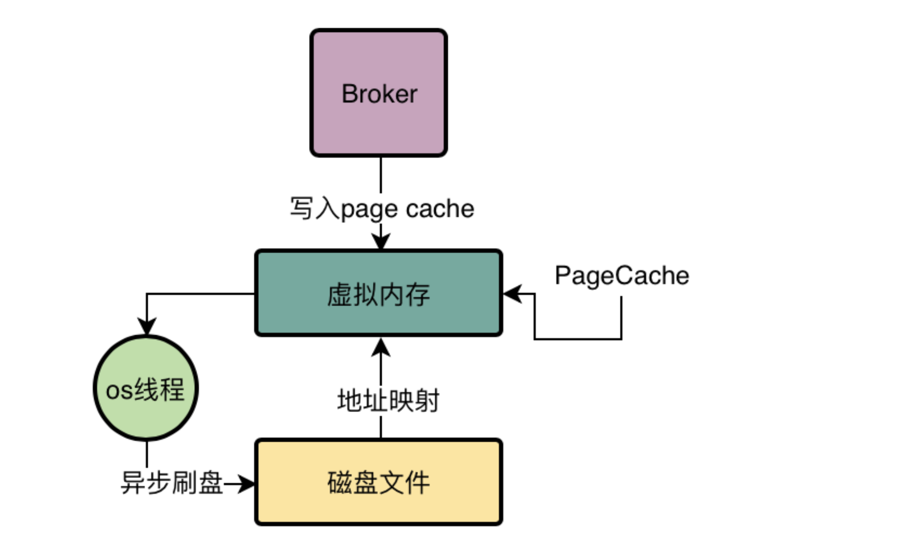

# mmap：Broker读写磁盘文件的核心技术

今天我们要给大家介绍一个非常关键的黑科技，很多人可能都不太熟悉，这个技术就是mmap技术，而Broker中就是大量的使用mmap技术去实现CommitLog这种大磁盘文件的高性能读写优化的。

通过之前的学习，我们知道了一点，就是Broker对磁盘文件的写入主要是借助直接写入os cache来实现性能优化的，因为直接写入os cache，相当于就是写入内存一样的性能，后续等os内核中的线程异步把cache中的数据刷入磁盘文件即可。

那么今天我们就要对这个过程中涉及到的mmap技术进行一定的分析。

# 传统文件IO操作的多次数据拷贝问题
首先我们先来给大家分析一下，假设RocketMQ没有使用mmap技术，就是使用最传统和基本的普通文件IO操作去进行磁盘文件的读写，那么会存在什么样的性能问题？

答案是：多次数据拷贝问题

读取文件的顺序，首先从磁盘上把数据读取到内核IO缓冲区里去，然后再从内核IO缓存区里读取到用户进程私有空间里去，然后我们才能拿到这个文件里的数据

没错，所以这个就是普通的IO操作的一个弊端，必然涉及到两次数据拷贝操作，对磁盘读写性能是有影响的。

在数据进入磁盘文件的过程中，是不是再一次发生了两次数据拷贝？没错，所以这就是传统普通IO的问题，有两次数据拷贝问题。

# RocketMQ是如何基于mmap技术+page cache技术优化的

首先，RocketMQ底层对CommitLog、ConsumeQueue之类的磁盘文件的读写操作，基本上都会采用mmap技术来实现。

如果具体到代码层面，就是基于JDK NIO包下的MappedByteBuffer的map()函数，来先将一个磁盘文件（比如一个CommitLog文件，或者是一个ConsumeQueue文件）映射到内存里来

其实有的人可能会误以为是直接把那些磁盘文件里的数据给读取到内存里来了，类似这个意思，但是并不完全是对的。

因为刚开始你建立映射的时候，并没有任何的数据拷贝操作，其实磁盘文件还是停留在那里，只不过他把物理上的磁盘文件的一些地址和用户进程私有空间的一些虚拟内存地址进行了一个映射

这个地址映射的过程，就是JDK NIO包下的MappedByteBuffer.map()函数干的事情，底层就是基于mmap技术实现的。

# 基于mmap技术+pagecache技术实现高性能的文件读写

接下来就可以对这个已经映射到内存里的磁盘文件进行读写操作了，比如要写入消息到CommitLog文件，你先把一个CommitLog文件通过MappedByteBuffer的map()函数映射其地址到你的虚拟内存地址。

接着就可以对这个MappedByteBuffer执行写入操作了，写入的时候他会直接进入PageCache中，然后过一段时间之后，由os的线程异步刷入磁盘中，如下图我们可以看到这个示意。

对了！就是上面的图里，似乎只有一次数据拷贝的过程，他就是从PageCache里拷贝到磁盘文件里而已！这个就是你使用mmap技术之后，相比于传统磁盘IO的一个性能优化。

接着如果我们要从磁盘文件里读取数据呢？

那么此时就会判断一下，当前你要读取的数据是否在PageCache里？如果在的话，就可以直接从PageCache里读取了！

比如刚写入CommitLog的数据还在PageCache里，此时你Consumer来消费肯定是从PageCache里读取数据的。

但是如果PageCache里没有你要的数据，那么此时就会从磁盘文件里加载数据到PageCache中去，如下图

大家可以看到，在你读取数据的时候，其实也仅仅发生了一次拷贝，而不是两次拷贝，所以这个性能相较于传统IO来说，肯定又是提高了。

