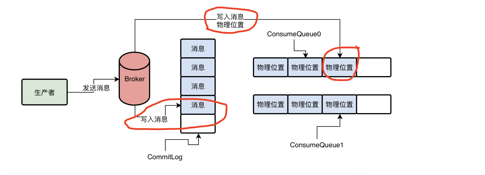
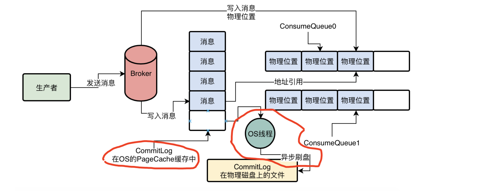

Broker数据存储实际上才是一个MQ最核心的环节，他决定了生产者消息写入的吞吐量，决定了消息不能丢失，决定了消费者获取消息的吞吐量，这些都是由他决定的。

# CommitLog消息顺序写入机制
首先我们来思考一下，当生产者的消息发送到一个Broker上的时候，他接收到了一条消息，接着他会对这个消息做什么事情？

首先第一步，他会把这个消息直接写入磁盘上的一个日志文件，叫做CommitLog，直接顺序写入这个文件，如下图。

这个CommitLog是很多磁盘文件，每个文件限定最多1GB，Broker收到消息之后就直接追加写入这个文件的末尾，就跟上面的图里一样。如果一个CommitLog写满了1GB，就会创建一个新的CommitLog文件。

# MessageQueue在数据存储中是体现在哪里呢？

其实在Broker中，对Topic下的每个MessageQueue都会有一系列的ConsumeQueue文件。

就是在Broker的磁盘上，会有下面这种格式的一系列文件：
$HOME/store/consumequeue/{topic}/{queueId}/{fileName}

我们之前说过，对每个Topic你不是在这台Broker上都会有一些MessageQueue吗？所以你会看到，{topic}指代的就是某个Topic，{queueId}指代的就是某个MessageQueue。

然后对存储在这台Broker机器上的Topic下的一个MessageQueue，他有很多的ConsumeQueue文件，这个ConsumeQueue文件里存储的是一条消息对应在CommitLog文件中的offset偏移量。

比如现在这条消息在生产者发送的时候是发送给MessageQueue0的，那么此时Broker就会将这条消息在CommitLog中的offset偏移量，写入到MessageQueue0对应的ConsumeQueue0中去，如下图所示。

# 如何让消息写入CommitLog文件近乎内存写性能的

接着我们给大家讲一个比较关键的概念：对于生产者把消息写入到Broker时，Broker会直接把消息写入磁盘上的CommitLog文件，那么Broker是如何提升整个过程的性能的呢？

但是如果你把消息写入CommitLog磁盘文件的性能优化为只需要1ms，那么每个线程每秒可以处理1000个消息写入，此时100个线程每秒可以处理10万个写入消息请求。所以大家可以明显看到，Broker把接收到的消息写入CommitLog磁盘文件的性能，对他的TPS有很大的影响。

所以在这里，Broker是基于OS操作系统的PaperCache和顺序写两个机制，来提升写入CommitLog文件的性能的。

首先Broker是以顺序的方式将消息写入CommitLog磁盘文件的，也就是每次写入就是在文件末尾追加一条数据就可以了，对文件进行顺序写的性能要比对文件随机写的性能提升很多

另外，数据写入CommitLog文件的时候，其实不是直接写入底层的物理磁盘文件的，而是先进入OS的PageCache内存缓存中，然后后续由OS的后台线程选一个时间，异步化的将OS PageCache内存缓冲中的数据刷入底层的磁盘文件。

采用磁盘文件顺序写+OS PageCache写入+OS异步刷盘的策略，基本上可以让消息写入CommitLog的性能跟你直接写入内存里是差不多的，所以正是如此，才可以让Broker高吞吐的处理每秒大量的消息写入。

# 同步刷盘与异步刷盘

## 异步刷盘模式
我们看下面的图，红圈圈出来了数据早os cache里的情况，如果此时broker宕机，那么必然导致这里的数据丢失，而producer还以为数据已经写入成功了，以为不会丢失，所以肯定是有问题的。

所以异步刷盘的的策略下，可以让消息写入吞吐量非常高，但是可能会有数据丢失的风险，这个是大家需要清楚的。

## 同步刷盘模式

另外一种模式叫做同步刷盘，如果你使用同步刷盘模式的话，那么生产者发送一条消息出去，broker收到了消息，必须直接强制把这个消息刷入底层的物理磁盘文件中，然后才会返回ack给producer，此时你才知道消息写入成功了。

如果broker还没有来得及把数据同步刷入磁盘，然后他自己挂了，那么此时对producer来说会感知到消息发送失败了，然后你只要不停的重试发送就可以了，直到有slave broker切换成master broker重新让你可以写入消息，此时可以保证数据是不会丢的。

但是如果你强制每次消息写入都要直接进入磁盘中，必然导致每条消息写入性能急剧下降，导致消息写入吞吐量急剧下降，但是可以保证数据不会丢失。