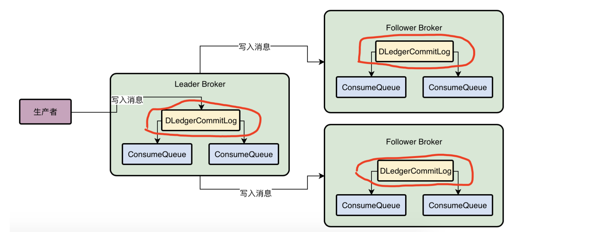

# DLedger主从同步原理

首先，我们回顾一下，上一次已经讲到，producer写入消息到broker之后，broker会将消息写入本地CommitLog磁盘文件里去，然后还有一些ConsumeQueue会存储Topic下各个MessageQueue的消息的物理位置。

而且我们给大家说过，如果要让Broker实现高可用，那么必须有一个Broker组，里面有一个是Leader Broker可以写入数据，然后让Leader Broker接收到数据之后，直接把数据同步给其他的Follower Broker

这样的话，一条数据就会在三个Broker上有三份副本，此时如果Leader Broker宕机，那么就直接让其他的Follower Broker自动切换为新的Leader Broker，继续接受客户端的数据写入就可以了。

# 基于DLedger技术替换Broker的CommitLog

DLedger技术实际上首先他自己就有一个CommitLog机制，你把数据交给他，他会写入CommitLog磁盘文件里去，这是他能干的第一件事情。

所以首先我们在下面的图里可以看到，如果基于DLedger技术来实现Broker高可用架构，实际上就是用DLedger先替换掉原来Broker自己管理的CommitLog，由DLedger来管理CommitLog

所以首先第一步大家要知道的是，我们需要使用DLedger来管理CommitLog，然后Broker还是可以基于DLedger管理的CommitLog去构建出来机器上的各个ConsumeQueue磁盘文件。

# DLedger是如何基于Raft协议选举Leader Broker的

既然我们现在知道首先基于DLedger替换各个Broker上的CommitLog管理组件了，那么就是每个Broker上都有一个DLedger组件了

基于Raft协议来进行Leader Broker选举的，那么Raft协议中是如何进行多台机器的Leader选举的呢？

这需要发起一轮一轮的投票，通过三台机器互相投票选出来一个人作为Leader。

此时在第一轮选举中，Broker01会收到别人的投票，他发现自己是投票给自己，但是Broker02投票给Broker02自己，Broker03投票给Broker03自己，似乎每个人都很自私，都在投票给自己，所以第一轮选举是失败的。

因为大家都投票给自己，怎么选举出来一个Leader呢？

接着每个人会进入一个随机时间的休眠，比如说Broker01休眠3秒，Broker02休眠5秒，Broker03休眠4秒。

此时Broker01必然是先苏醒过来的，他苏醒过来之后，直接会继续尝试投票给自己，并且发送自己的选票给别人。

接着Broker03休眠4秒后苏醒过来，他发现Broker01已经发送来了一个选票是投给Broker01自己的，此时他自己因为没投票，所以会尊重别人的选择，就直接把票投给Broker01了，同时把自己的投票发送给别人。

接着Broker02苏醒了，他收到了Broker01投票给Broker01自己，收到了Broker03也投票给了Broker01，那么他此时自己是没投票的，直接就会尊重别人的选择，直接就投票给Broker01，并且把自己的投票发送给别人。

此时所有人都会收到三张投票，都是投给Broker01的，那么Broker01就会当选为Leader。

其实只要有（3台机器 / 2） + 1个人投票给某个人，就会选举他当Leader，这个（机器数量 / 2） + 1就是大多数的意思。

这就是Raft协议中选举leader算法的简单描述，简单来说，他确保有人可以成为Leader的核心机制就是一轮选举不出来Leader的话，就让大家随机休眠一下，先苏醒过来的人会投票给自己，其他人苏醒过后发现自己收到选票了，就会直接投票给那个人。

因此我们看下图，在三台Broker机器刚刚启动的时候，就是靠这个DLedger基于Raft协议实现的leader选举机制，互相投票选举出来一个Leader，其他人就是Follower，然后只有Leader可以接收数据写入，Follower只能接收Leader同步过来的数据。

# DLedger是如何基于Raft协议进行多副本同步的

DLedger在进行同步的时候是采用Raft协议进行多副本同步的，我们接下来聊一下Raft协议中的多副本同步机制。

简单地说，数据同步会分为两个阶段，一个是uncommitted阶段，一个是commited阶段

首先Leader Broker上的DLedger收到一条数据之后，会标记为uncommitted状态，然后他会通过自己的DLedgerServer组件把这个uncommitted数据发送给Follower Broker的DLedgerServer。

接着Follower Broker的DLedgerServer收到uncommitted消息之后，必须返回一个ack给Leader Broker的DLedgerServer，然后如果Leader Broker收到超过半数的Follower Broker返回ack之后，就会将消息标记为committed状态。

然后Leader Broker上的DLedgerServer就会发送commited消息给Follower Broker机器的DLedgerServer，让他们也把消息标记为comitted状态。

这个就是基于Raft协议实现的两阶段完成的数据同步机制。

# 如果Leader Broker崩溃了怎么办

如果Leader Broker挂了，此时剩下的两个Follower Broker就会重新发起选举，他们会基于DLedger还是采用Raft协议的算法，去选举出来一个新的Leader Broker继续对外提供服务，而且会对没有完成的数据同步进行一些恢复性的操作，保证数据不会丢失。

# 采用Raft协议进行主从数据同步，会影响TPS吗

今天我们想让大家思考一个问题，基于DLedger技术管理CommitLog之后，可以自动在一组Broker中选举出来一个Leader

然后在Leader接收消息写入的时候，基于DLedger技术写入本地CommitLog中，这个其实跟之前让Broker自己直接写入CommitLog是没什么区别的。

但是有区别的一点在于，Leader Broker上的DLedger在收到一个消息，将uncommitted消息写入自己本地存储之后，还需要基于Raft协议的算法，去采用两阶段的方式把uncommitted消息同步给其他Follower Broker

必须要超过一半的Follower Broker的DLedger对uncommitted消息返回ack，此时Leader Broker才能返回ACK给生产者，说这次写入成功了。

也就是说，这样的一个架构对每次写入都平添了一个成本，每次写入都必须有超过半数的Follower Broker都写入消息才可以算做一次写入成功