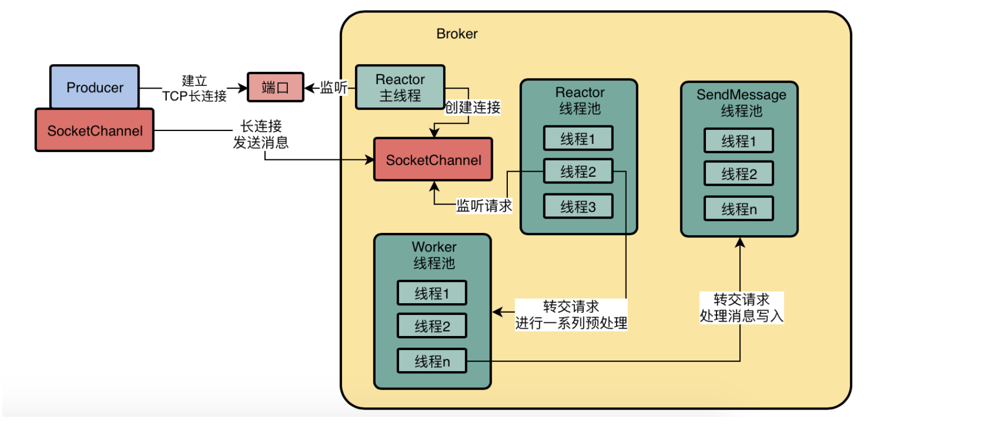

# Brocker中的Reactor模型过程

## Reactor主线程与长短连接 

首先，作为Broker而言，他会有一个Reactor主线程。而且这个线程是负责监听一个网络端口的，比如监听个2888，39150这样的端口。

> TCP长连接

如果你对网络没太多的了解，简单理解为TCP就是一个协议，所谓协议的意思就是，按照TCP这个协议规定好的步骤建立连接，按照他规定好的步骤发送请求。

比如你要建立一个TCP连接，必须先给对方发送他规定好的几个数据，然后人家按照规定返回给你几个数据，你再给人家发送几个数据，一切都按TCP的规定来。按照规定来，大家就可以建立一个TCP连接。

## Producer和Broker建立一个长连接

接着比如有一个Producer他就要跟Broker建立一个TCP长连接了，此时Broker上的这个Reactor主线程，他会在端口上监听到这个Producer建立连接的请求

Producer里面会有一个SocketChannel，Broker里也会有一个SocketChannel，这两个SocketChannel就代表了他们俩建立好的这个长连接。

接着下一个问题来了，既然Producer和Broker之间已经通过SocketChannel维持了一个长连接了，接着Producer会通过这个SocketChannel去发送消息给Broker

## 基于Reactor线程池监听连接中的请求

然后Reactor主线程建立好的每个连接SocketChannel，都会交给这个Reactor线程池里的其中一个线程去监听请求。

现在有了Reactor线程池这个概念，我们总算是可以让Producer发送请求过来了，他发送一个消息过来到达Broker里的SocketChannel，此时Reactor线程池里的一个线程会监听到这个SocketChannel中有请求到达了！

## 基于Worker线程池完成一系列准备工作

接着Reactor线程从SocketChannel中读取出来一个请求，这个请求在正式进行处理之前，必须就先要进行一些准备工作和预处理，比如SSL加密验证、编码解码、连接空闲检查、网络连接管理，诸如此类的一些事

这个时候需要引入一个新的概念，叫做Worker线程池，他默认有8个线程，此时Reactor线程收到的这个请求会交给Worker线程池中的一个线程进行处理，会完成上述一系列的准备工作

## 基于业务线程池完成请求的处理

你接收到了消息，肯定是要写入CommitLog文件的，后续还有一些ConsumeQueue之类的事情需要处理，类似这种操作，就是业务处理逻辑。

这个时候，就得继续把经过一系列预处理之后的请求转交给业务线程池

比如对于处理发送消息请求而言，就会把请求转交给SendMessage线程池，而且如果大家还有一点点印象的话，其实在之前讲集群部署的时候，我们讲到过这个SendMessage线程是可以配置的，你配置的越多，自然处理消息的吞吐量越高。

# 为什么这套网络通信框架会是高性能以及高并发的
原因很简单，假设我们只有一个线程来处理所有的网络连接的请求，包括读写磁盘文件之类的业务操作，那么会导致我们的并发能力必然很低。

所以必须专门分配一个Reactor主线程出来，就是专门负责跟各种Producer、Consumer之类的建立长连接。

一旦连接建立好之后，大量的长连接均匀的分配给Reactor线程池里的多个线程。

每个Reactor线程负责监听一部分连接的请求，这个也是一个优化点，通过多线程并发的监听不同连接的请求，可以有效的提升大量并发请求过来时候的处理能力，可以提升网络框架的并发能力。

接着后续对大量并发过来的请求都是基于Worker线程池进行预处理的，当Worker线程池预处理多个请求的时候，Reactor线程还是可以有条不紊的继续监听和接收大量连接的请求是否到达。

而且最终的读写磁盘文件之类的操作都是交给业务线程池来处理的，当他并发执行多个请求的磁盘读写操作的时候，不影响其他线程池同时接收请求、预处理请求，没任何的影响。

所以最终的效果就是：

- Reactor主线程在端口上监听Producer建立连接的请求，建立长连接
- Reactor线程池并发的监听多个连接的请求是否到达
- Worker请求并发的对多个请求进行预处理
- 业务线程池并发的对多个请求进行磁盘读写业务操作

这些事情全部是利用不同的线程池并发执行的！任何一个环节在执行的时候，都不会影响其他线程池在其他环节进行请求的处理！

这样的一套网络通信架构，最终实现的效果就是可以高并发、高吞吐的对大量网络连接发送过来的大量请求进行处理，这是保证Broker实现高吞吐的一个非常关键的环节，就是这套网络通信架构。

因此对于这类中间件，如果你给他部署在高配置的物理机上，有几十个CPU核，那么此时你可以增加他的各种线程池的线程数量，这样就可以让各个环节同时高并发的处理大量的请求，由大量的CPU核来支持大量线程的并发工作。

