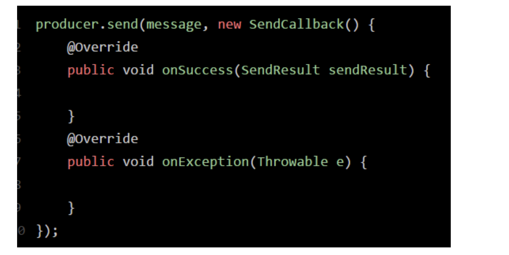

# 消息发送方式

## 什么叫做同步发送消息到RocketMQ
所谓同步，意思就是你通过这行代码发送消息到MQ去，SendResult sendResult = producer.send(msg)，然后你会卡在这里，代码不能往下走了

你要一直等待MQ返回一个结果给你，你拿到了SendResult之后，接着你的代码才会继续往下走。

## 什么叫做异步发送消息到RocketMQ



这个意思就是说，你把消息发送出去，然后上面的代码就直接往下走了，不会卡在这里等待MQ返回结果给你！

然后当MQ返回结果给你的时候，Producer会回调你的SendCallback里的函数，如果发送成功了就回调onSuccess函数，如果发送失败了就回调onExceptino函数。

## 什么叫做发送单向消息到RocketMQ？

```
producer.sendOneWay(msg);
```

这个sendOneway的意思，就是你发送一个消息给MQ，然后代码就往下走了，根本不会关注MQ有没有返回结果给你，你也不需要MQ返回的结果，无论发送的消息是成功还是失败，都不关你的事。

