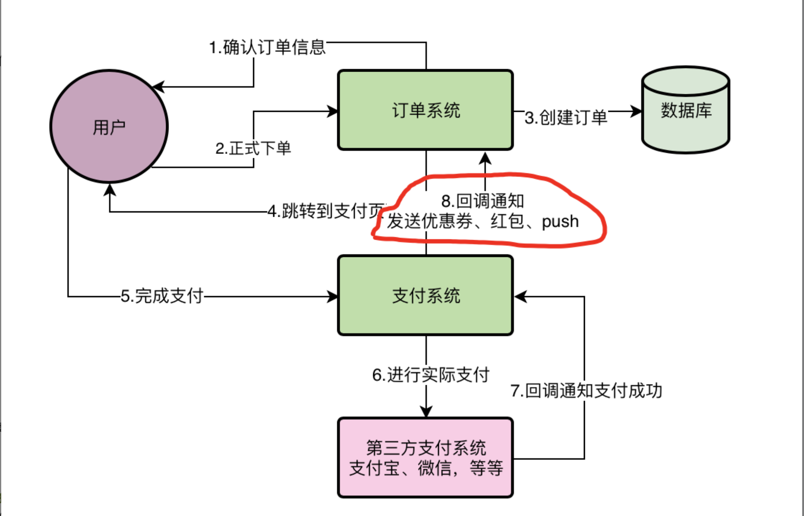

# 电商业务背景
电商业务流程

订单系统功能

综合下来而言，根据线上系统的接口统计数据来看，晚上购物最活跃的时候，订单系统下单最顶点的高峰时段每秒会有超过2000的请求，这就是订单系统的最高负载。其他时候都比这个负载会低不少。
利用8台8核16G的机器，因此高峰期每台机器的请求大概是每秒200~300之间。但是这8台订单系统部署的服务器都是连接一台数据库服务器的，数据库服务器的配置是16核32G，而且是SSD固态硬盘的，用的是比较高配置比较贵的机器，因此性能会更好一些。

现在线上这样的一个机器部署情况，在高峰期每秒2000以上请求的情况下是很轻松可以抗住的

但是今天最后的最重要的一个主题，就是先给你讲一个现在系统最明显的一个技术问题，也是影响用户体验的一个问题。
在上面那个图的第8个步骤里，其实我们除了发优惠券、发红包、发送Push通知给用户之外，还要做很多其他的事情。
比如：对于一个电商APP而言，你卖掉了一个商品，就要扣减掉商品的库存，而且一旦用户成功支付了，你还得更新订单的状态变成待发货。因此在高峰期的时候，有的时候甚至需要几秒钟的时间完成上述几个步骤。