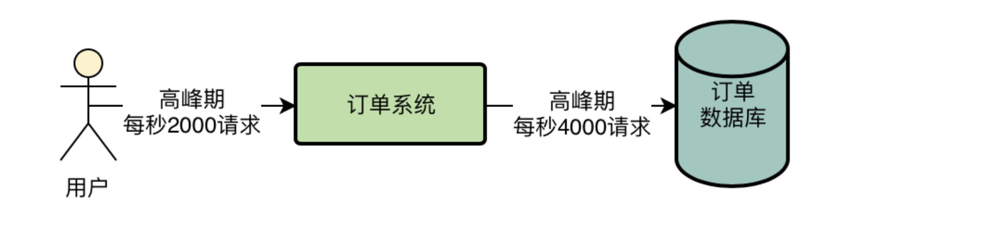

# 大促活动问题

所以大致在我们这里，结合线上数据库的可视化监控界面，基本可以知道，平均每次订单系统的接口调用，会执行2次数据库操作，我们观察数据库的监控界面，在最高峰的时候，每秒大概是有4000左右的请求。

现在已经明显发现每天高峰时间公司搞秒杀活动的时候，比以前有更多的用户在某个时间点蹲守在手机APP前。特价秒杀商品时间一到，就有大量的并发请求过来，系统压力非常大

如果仅仅是订单系统自己本身压力过大，还不是太大的问题。因为订单系统目前部署了20台4核8G的机器，整个集群抗每秒上万请求压力是可以的，即使后续用户量越来越大，大不了就是给订单系统加更多的机器就可以了。

但是这里有一个问题，20台订单系统的机器都是访问同一台机器上部署的MySQL数据库的，那一台数据库服务器目前经常在晚上秒杀活动的时候，瞬时并发量达到上万。

# 秒杀活动压力过大怎么办？难道是加机器吗？

这个是没问题的，订单系统自己是可以通过部署更多的机器进行线性扩展的。

但是第二个问题来了，那么数据库呢？是不是也要部署更多的服务器，进行分库分表，然后让更多的数据库服务器来抗超高的数据库高并发访问？

这种方式不好，一旦量上来了，就要不停的增加更多的机器