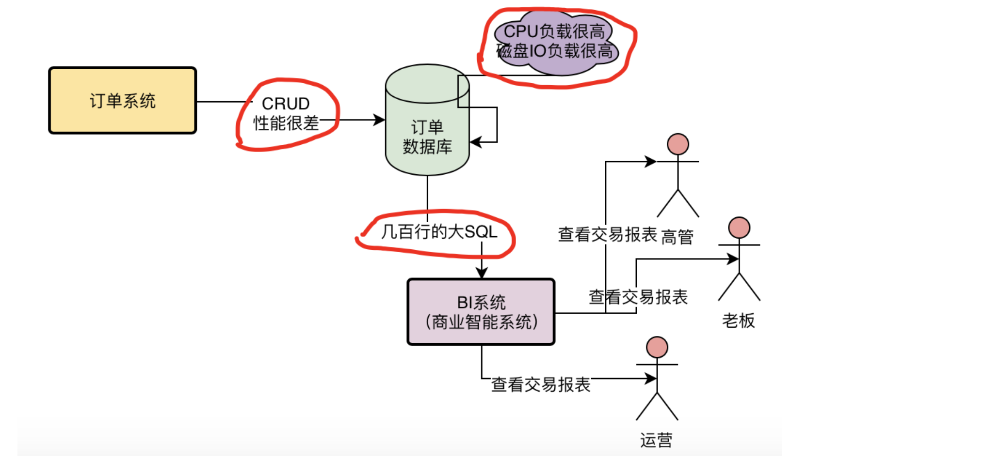
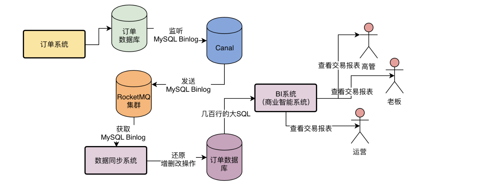
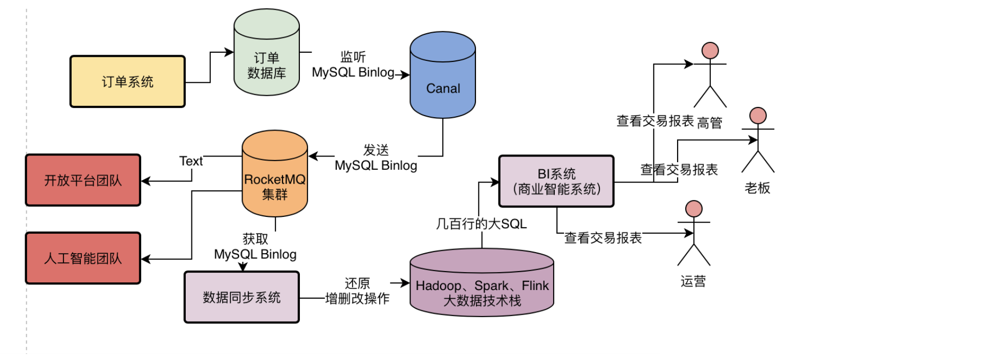

# 大数据团队对订单数据报表统计

所以每天如果有100万用户来访问你的APP，积累下来的一些浏览行为、访问行为、交易行为都是各种数据，这个数据量很大，所以你可以称之为“大数据”

最low的做法：直接从订单库里select数据出来

在图里很清晰地看到，大数据团队的BI系统每天都会直接在订单数据库里执行上百次几百行的大SQL，而每次一个几百行大SQL的执行都需要耗时几秒到十几秒不等

每次这样一个几百行的大SQL执行，都会导致MySQL数据库服务器的资源负载急剧抖动，会让CPU、内存、磁盘IO的负载都瞬间升高。

# 不好的方案

然后我们一步步分析了如何将数据同步给大数据团队，先是考虑在订单系统代码内部嵌入一些额外的代码，将订单的增删改操作发送到RocketMQ里，但是后来发现这样会导致污染订单系统的代码。

# MySQL Binlog同步方案

这种系统会监听MySQL数据库的Binlog，所谓Binlog大致可以理解为MySQL的增删改操作日志。

然后MySQL Binlog同步系统会将监听到的MySQL Binlog（也就是增删改操作日志）发送给你的系统，让你来处理这些增删改操作日志。

这种MySQL Binlog系统现在是有不少成熟的开源技术方案的，比如阿里开源的Canal，以及Linkedin开源的Databus，都可以监听MySQL Binlog，然后将MySQL Binlog发送给你的系统，交给你去处理。

因此完全可以将数据同步方案修改为如下所示，采用Canal监听MySQL Binlog，然后直接发送到RocketMQ里

然后大数据团队的数据同步系统从RocketMQ中获取到MySQL Binlog，也就获取到了订单数据库的增删改操作，接着把增删改操作还原到自己的数据库中去就可以。

而且这样的一套方案还有一个额外的好处，就是由订单技术团队将完整的订单数据库的MySQL Binlog推送到RocketMQ里

无论是大数据团队，还是未来公司的其他技术团队，比如说开放平台团队，人工智能团队，等等，只要想要订单数据，都可以直接从这个RocketMQ里去获取完整的订单数据。

说到这里，我们要给大家解释一下，实际上大数据团队并没有必要仅仅只通过MySQL来出数据报表，完全可以采用Hadoop、Spark、Flink等大数据技术来出数据报表。

