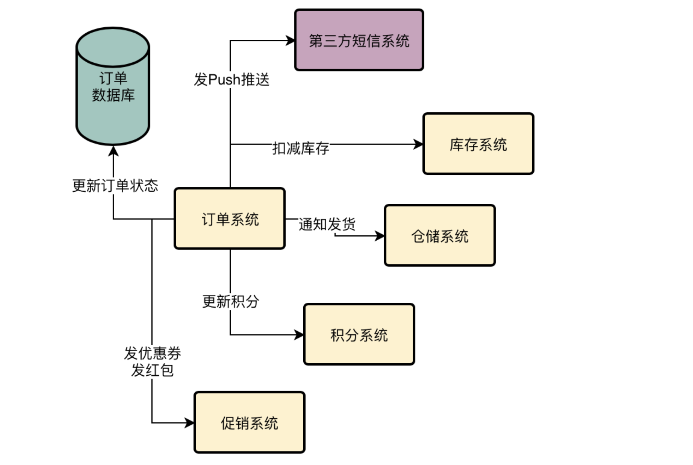
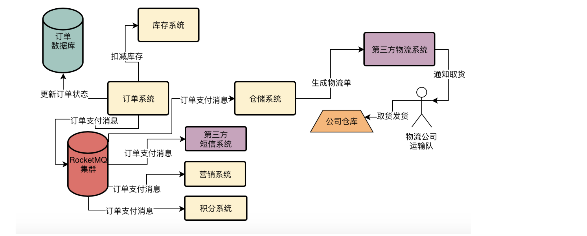

而且昨天明哥也给小猛指出了系统现在面临的第一个问题，就是支付成功之后的核心业务流程里混杂的子步骤太多了：
扣减库存、更新订单状态、更新积分、发优惠券、发红包、发送Push推送、通知仓储系统发货，等等一系列的事情要做。
这一连串的步骤有时候在系统高峰期压力大的时候，可能需要好几秒才能完成，让用户体验非常的不好。

# 技术方案：通过引入MQ实现订单核心流程的异步化改造
所以实际上我们需要的一个效果是：在用户支付完毕后，只要执行最核心的更新订单状态以及扣减库存就可以了，保证速度足够快。

然后诸如增加积分、发送优惠券、发送短信、通知发货的操作，都可以通过MQ实现异步化执行。

在上面的图里，订单系统仅仅会同步执行更新订单状态和扣减库存两个最关键的操作，因为一旦你支付成功，只要保证订单状态变为“已支付”，库存扣减掉，就可以保证核心数据不错乱。

然后订单系统接着会发送一个订单支付的消息到RocketMQ中去，然后积分系统会从RocketMQ里获取到消息，然后根据消息去累加积分。
营销系统会从RocketMQ里获取到消息然后发送优惠券，推送系统会从RocketMQ里获取到消息然后推送短信，仓储系统会从RocketMQ里获取到消息然后生产物流单核和发货单，去通知仓库管理员打包商品，准备交接给物流公司去发货。